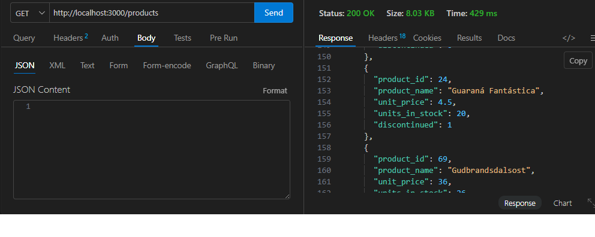
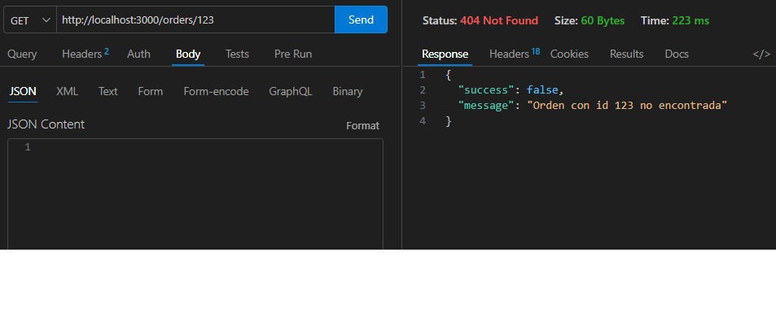
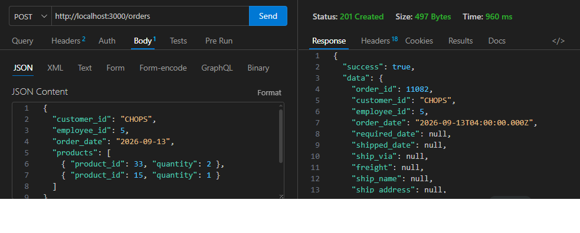
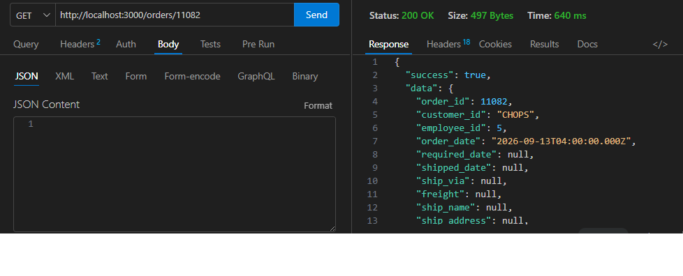
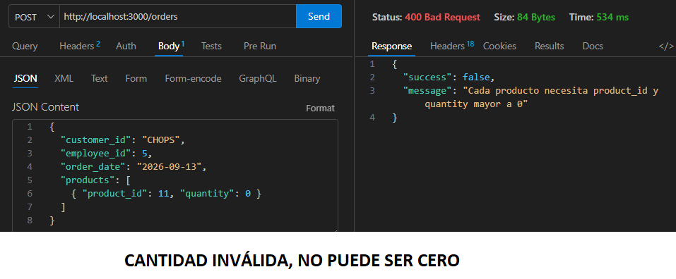
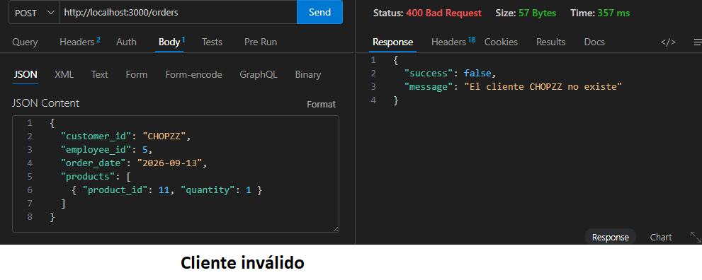
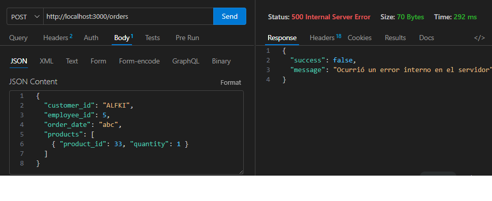

# API REST - PRIMER PARCIAL DE TECNOLOGÍAS WEB II - 2026

API desarrollada con Express.js y PostgreSQL.
Sirve para generar órdenes de venta.
Se utiliza con la base Northwind.

## Tecnologías
- Express.js
- PostgreSQL
- Librerías: pg, dotenv, cors, helmet, morgan, nodemon (dev)

## Requisitos previos
- Node.js instalado (v18 o superior)
- PostgreSQL instalado y corriendo
- Base de datos Northwind cargada en PostgreSQL

## Instalación
1. Clonar este repositorio y entra a la carpeta del proyecto:
```bash
   git clone https://github.com/ErnstBasc/PrimerParcialWEBII.git
   cd PrimerParcialWEBII
```

2. Instalar las dependencias:
```bash
   npm install
```

3. Copiar el archivo de variables de entorno de ejemplo y complétalo con tus 
   propios datos de conexión:
```bash
   cp .env.example .env
```
   Edita `.env` con tus credenciales reales de PostgreSQL.
  

## Iniciar el servidor

```bash
npm run dev
```
Esto inicia el servidor con `nodemon` (recarga automática al detectar 
cambios) en el puerto definido por la variable `PORT` (por defecto 3000). 

Para producción, usa `npm start` (sin recarga automática).

## Endpoints disponibles

| Método | Ruta            | Descripción                                    |
|--------|-----------------|-------------------------------------------------|
| GET    | `/customers`    | Lista todos los clientes                        |
| GET    | `/products`     | Lista todos los productos                       |
| GET    | `/orders/:id`   | Consulta una orden específica con su detalle    |
| POST   | `/orders`       | Crea una nueva orden con su detalle             |

## Métodos HTTP utilizados

### GET — Lectura

Los endpoints GET /customers, GET /products y GET /orders/:id son 
seguros e idempotentes. Se usan exclusivamente para 
consultar información ya existente en la base de datos: la lista de 
clientes, la lista de productos disponibles, o el detalle completo de 
una orden específica.

### POST — creación de un nuevo recurso

El endpoint POST /orders no es seguro ni idempotente: cada 
solicitud crea una orden nueva en la base de datos, con un order_id 
propio, incluso si el cuerpo de la petición es idéntico a una anterior. 
Antes de insertar cualquier dato, valida que el cliente, el empleado y 
cada producto enviado existan, y que las cantidades sean válidas (mayor que cero). El 
precio unitario de cada producto se obtiene directamente desde la base 
de datos y toda la operación (cabecera + detalle) se ejecuta dentro de una transacción, 
garantizando que nunca quede una orden incompleta si algo falla a mitad 
de camino. El cliente no puede colocar el precio.

### Códigos utilizados

| Código | Cuándo se usa |
|--------|----------------|
| 200  | Lectura exitosa (`GET`) |
| 201  | Creación exitosa de una orden (`POST /orders`) |
| 400  | Datos inválidos o inexistentes (cliente, empleado o producto que no existe; cantidad inválida) |
| 404  | Orden solicitada por `id` que no existe |
| 500  | Error inesperado del servidor (nunca expone detalles internos) |

## Ejemplo de solicitud — POST /orders

```json
{
  "customer_id": "ALFKI",
  "employee_id": 5,
  "order_date": "2026-09-11",
  "products": [
    { "product_id": 11, "quantity": 3 },
    { "product_id": 42, "quantity": 1 }
  ]
}
```

## Flujo de generación de una orden

1. El cliente envía un `POST /orders` con `customer_id`, `employee_id`, 
   `order_date` y una lista de `products` (cada uno con `product_id` y 
   `quantity`).
2. El servidor valida que el cliente, el empleado y cada producto existan, 
   y que las cantidades sean válidas.
3. El precio unitario de cada producto se obtiene directamente de la base 
   de datos (nunca se confía en un precio enviado por el cliente).
4. La cabecera y sus líneas de detalle se insertan dentro de una 
   **transacción**: si cualquier validación o inserción falla, se revierte 
   todo (`ROLLBACK`), evitando órdenes incompletas.
5. Si todo es correcto, se responde con código `201` y la orden completa.

## Manejo de errores

La API centraliza el manejo de errores en `middlewares/errorHandler.js`. 
Los errores de validación (cliente, empleado o producto inexistente, 
cantidades inválidas) responden con código `400` y un mensaje claro. 
Los errores inesperados de servidor responden con `500`, sin exponer 
detalles internos del sistema o de la base de datos.

## Seguridad

- Consultas parametrizadas (`$1`, `$2`, ...) en todas las queries, para 
  evitar inyección SQL.
- `helmet()` para headers HTTP de seguridad.
- `cors()` habilitado para permitir solicitudes desde distintos orígenes.
- Variables sensibles gestionadas mediante `.env`, excluido del 
  repositorio (ver `.gitignore`).

## Pruebas y evidencia de funcionamiento

### 1. Consulta de clientes (GET /customers)


### 2. Consulta de productos (GET /products)


### 3. Orden inexistente (GET /orders/:id — 404 controlado)


### 4. Creación exitosa de una orden (POST /orders — 201)


### 5. Consulta de la orden recién creada (GET /orders/:id — 200)


### 6. Error controlado — cantidad inválida (400)


### 7. Error controlado — cliente inexistente (400)


### 8. Error controlado — producto inexistente o fuera de rango (400)


### 9. Error interno del servidor — fecha con formato inválido (500)


Nótese que en el caso 9, la respuesta al cliente no expone ningún detalle 
técnico interno (mensaje genérico "Ocurrió un error interno en el 
servidor"), mientras que el error completo queda registrado únicamente 
en la terminal del servidor mediante `console.error`.

## Estructura del proyecto

├── index.js # Punto de entrada
├── db.js # Configuración del pool de PostgreSQL
├── routes/ # Definición de endpoints
├── controllers/ # Lógica de request/response
├── services/ # Consultas SQL, validaciones y transacciones
├── middlewares/ # Manejo centralizado de errores
├── .env.example # Plantilla de variables de entorno
└── evidencia/ # Capturas de pantalla de pruebas ejecutadas
